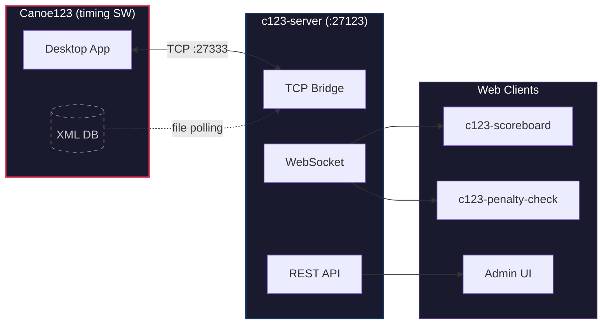

# Open Canoe Timing

Open-source timing solutions for canoe slalom races. Built by the community, for the community.

## About

Open Canoe Timing develops tools that work with **Canoe123** timing software to provide real-time scoreboards, data visualization, and race management utilities for canoe slalom competitions.

Our goal is to make professional-quality timing displays and tools accessible to clubs and race organizers of all sizes.

## Projects

### Core Applications

| Project | Description | Status |
|---------|-------------|--------|
| [c123-scoreboard](https://github.com/OpenCanoeTiming/c123-scoreboard) | Real-time scoreboard for live race display | Active |
| [c123-server](https://github.com/OpenCanoeTiming/c123-server) | WebSocket bridge between Canoe123 and web clients | Active |
| [c123-penalty-check](https://github.com/OpenCanoeTiming/c123-penalty-check) | Penalty entry and protocol verification app | In Development |
| [c123-live-mini](https://github.com/OpenCanoeTiming/c123-live-mini) | Lightweight live results display | Experimental |

### Infrastructure

| Project | Description |
|---------|-------------|
| [timing-design-system](https://github.com/OpenCanoeTiming/timing-design-system) | Shared UI components and styles |
| [c123-xml-tools](https://github.com/OpenCanoeTiming/c123-xml-tools) | XML utilities for race data processing |
| [c123-protocol-docs](https://github.com/OpenCanoeTiming/c123-protocol-docs) | Protocol and XML format documentation (private) |

> **c123-live-mini** is currently our testbed for issue-driven development
> using Spec-Driven Development (SDD) methodology with
> [GitHub SpecKit](https://github.com/marketplace/github-speckit) tooling.

## Architecture



## Quick Start

### Running the Scoreboard

```bash
# 1. Start the server (connects to Canoe123)
cd c123-server
npm install && npm start

# 2. Start the scoreboard
cd c123-scoreboard
npm install && npm run dev
```

The scoreboard will be available at `http://localhost:5173` and automatically connects to `c123-server` on port 27123.

## Technology

- **Frontend:** React, TypeScript, Vite
- **Backend:** Node.js, WebSocket
- **Styling:** CSS with design tokens, dark/light themes
- **Protocol:** Canoe123 TCP/XML

## Contributing

We welcome contributions! Please read our [Contributing Guide](https://github.com/OpenCanoeTiming/.github/blob/main/CONTRIBUTING.md) before getting started.

## Acknowledgements

This project would not exist without **[Canoe123](https://www.siwidata.com/)** — the professional timing system developed by **Siwidata**. Canoe123 is the backbone of canoe slalom timing at events worldwide, from local club races to World Championships.

We extend our gratitude to the Siwidata team for creating such a reliable and feature-rich timing solution, and for the protocol that makes these open-source extensions possible.

## License

All projects are released under the **MIT License** unless otherwise noted.

---

<sub>Built with ❤️ for the canoe slalom community</sub>
