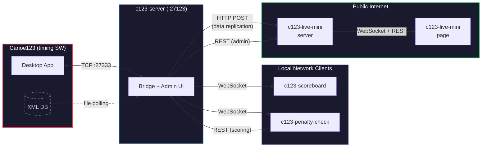

# Open Canoe Timing

Open-source timing solutions for canoe slalom races. Built by the community, for the community.

## About

Open Canoe Timing develops tools that work with **Canoe123** timing software to provide real-time scoreboards, data visualization, and race management utilities for canoe slalom competitions.

Our goal is to make professional-quality timing displays and tools accessible to clubs and race organizers of all sizes.

## Projects

### Core Applications

| Project | Description | Status |
|---------|-------------|--------|
| [c123-live-mini](https://github.com/OpenCanoeTiming/c123-live-mini) | Live results for spectators (public internet) | Active development |
| [c123-server](https://github.com/OpenCanoeTiming/c123-server) | WebSocket bridge between Canoe123 and web clients | Active development |
| [c123-scoreboard](https://github.com/OpenCanoeTiming/c123-scoreboard) | Real-time scoreboard for on-site race display | Stable |
| [c123-penalty-check](https://github.com/OpenCanoeTiming/c123-penalty-check) | Penalty verification against paper protocols | Stable (v1.1.0) |

### Infrastructure

| Project | Description | Status |
|---------|-------------|--------|
| [timing-design-system](https://github.com/OpenCanoeTiming/timing-design-system) | Shared CSS design system (`@czechcanoe/rvp-design-system`) | Stable |
| [c123-xml-tools](https://github.com/OpenCanoeTiming/c123-xml-tools) | XML utilities for race data processing | Stable |
| [c123-protocol-docs](https://github.com/OpenCanoeTiming/c123-protocol-docs) | Protocol documentation, recordings, and replay tools (private) | Active |

## Architecture


```mermaid
graph LR
    subgraph canoe123 ["Canoe123 (timing SW)"]
        C123[Desktop App]
        DB[(XML DB)]
    end

    subgraph server ["c123-server (:27123)"]
        SRV[Bridge + Admin UI]
    end

    subgraph local ["Local Network Clients"]
        SB[c123-scoreboard]
        PC[c123-penalty-check]
    end

    subgraph cloud ["Public Internet"]
        MINI_SRV["c123-live-mini<br/>server"]
        MINI_PAGE["c123-live-mini<br/>page"]
    end

    C123 <-->|"TCP :27333"| SRV
    DB -.->|"file polling"| SRV
    SRV -->|"WebSocket"| SB
    SRV -->|"WebSocket"| PC
    PC -->|"REST (scoring)"| SRV
    SRV -->|"HTTP POST<br/>(data replication)"| MINI_SRV
    SRV -->|"REST (admin)"| MINI_SRV
    MINI_SRV -->|"WebSocket + REST"| MINI_PAGE

    style canoe123 fill:#1a1a2e,stroke:#e94560,stroke-width:2px,color:#fff
    style server fill:#1a1a2e,stroke:#0f3460,stroke-width:2px,color:#fff
    style local fill:#1a1a2e,stroke:#533483,stroke-width:1px,color:#fff
    style cloud fill:#1a1a2e,stroke:#16a34a,stroke-width:2px,color:#fff
    style DB fill:none,stroke:#888,stroke-dasharray:5 5,color:#ccc
```

## Quick Start

### Running the Scoreboard

```bash
# 1. Start the server (connects to Canoe123)
cd c123-server
npm install && npm start

# 2. Start the scoreboard
cd c123-scoreboard
npm install && npm run dev
```

The scoreboard will be available at `http://localhost:5173` and automatically connects to `c123-server` on port 27123.

## Technology

- **Frontend:** React, TypeScript, Vite
- **Backend:** Node.js, WebSocket
- **Styling:** CSS with design tokens, dark/light themes
- **Protocol:** Canoe123 TCP/XML

## Contributing

We welcome contributions! Please read our [Contributing Guide](https://github.com/OpenCanoeTiming/.github/blob/main/CONTRIBUTING.md) before getting started.

## Acknowledgements

This project would not exist without **[Canoe123](https://www.siwidata.com/)** — the professional timing system developed by **Siwidata**. Canoe123 is the backbone of canoe slalom timing at events worldwide, from local club races to World Championships.

We extend our gratitude to the Siwidata team for creating such a reliable and feature-rich timing solution, and for the protocol that makes these open-source extensions possible.

## License

All projects are released under the **MIT License** unless otherwise noted.

---

<sub>Built with ❤️ for the canoe slalom community</sub>
